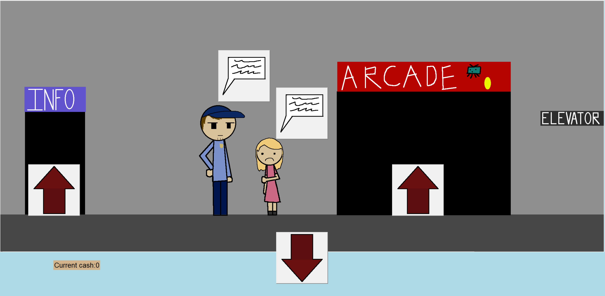

# Leave - a Point and Click adventure game

## Description
Leave is a point-and-click adventure game. You take the place of Dave, a kid who is trying to leave MegaMall and find his parents. To escape, you must navigate the mall, complete side quests, interact with characters, and find the exit. 
 
## How to use the project

1. Open up the Main.py file and run it.
2. Click on the various arrows and items around the area in order to progress

## Installation instructions

You need to install the external libraries Tkinter, Pillow, and PyGame for this. After that, as long as you have access to the Programming drive this should work.

## Contributors

- jcaps-ops (Art, Gameplay)
- Valerie5801 (Art, Arcade Games)
- BdzUcas (Data Storage, Coding Support)
- CupSlash (Games, Quality Control)

## Contribution Guidelines

If you would like to work on the game, or have questions, email briggs.hardy@ucas-edu.net

### © 2026 Utah County Academy of Sciences
